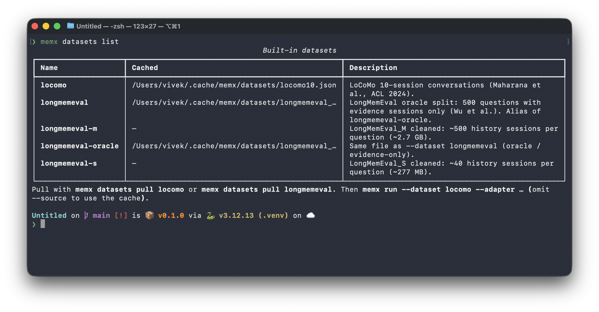

# Datasets

Datasets are the inputs to scoring **and** diagnosis. `memx datasets list` / `pull` and `memx run --dataset` share the same catalog.



Cache directory: `~/.cache/memx/datasets` unless `MEMX_CACHE_DIR` is set.

| `--dataset` | File | Notes |
| --- | --- | --- |
| `locomo` | `locomo10.json` | [LoCoMo](https://github.com/snap-research/locomo): 10 conversations, 1986 questions, 272 sessions |
| `longmemeval` | `longmemeval_oracle.json` | Evidence sessions only (~500 questions). Alias: `longmemeval-oracle` |
| `longmemeval-s` | `longmemeval_s_cleaned.json` | ~40 history sessions per question (~277 MB) |
| `longmemeval-m` | `longmemeval_m_cleaned.json` | ~500 history sessions per question (~2.7 GB) |

```bash
memx datasets pull locomo
memx run --dataset locomo --adapter supermemory --limit 5 --random
```

`--source path/to.json` uses a local file and does not download. The loader is still chosen from `--dataset` (`locomo` vs `longmemeval` JSON shapes).

`BenchmarkCase.sessions` is the complete official history. The harness always ingests that list, then asks selected questions. A shorter corpus belongs on the case (LongMemEval oracle already ships evidence sessions only).

Sampling (questions only; never trims sessions):

- `--limit N` without `--random`: first N questions in file order, serial cases. The case that owns those questions still ingests every session it has (on LoCoMo, often a full conversation).
- `--limit N --random`: uniform sample of N question ids; `--seed` makes it reproducible. Each owning case ingests its full haystack.
- LongMemEval: each question is its own case (`entity_id` = question id). Oracle haystack is evidence sessions; `-s` / `-m` haystacks are the full compiled histories (hosted cost and `--ready-timeout` go up).
