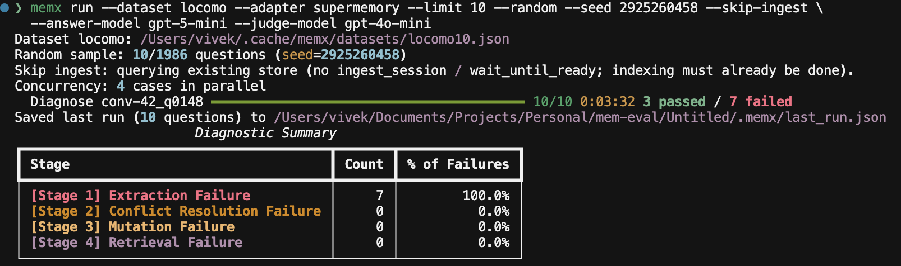
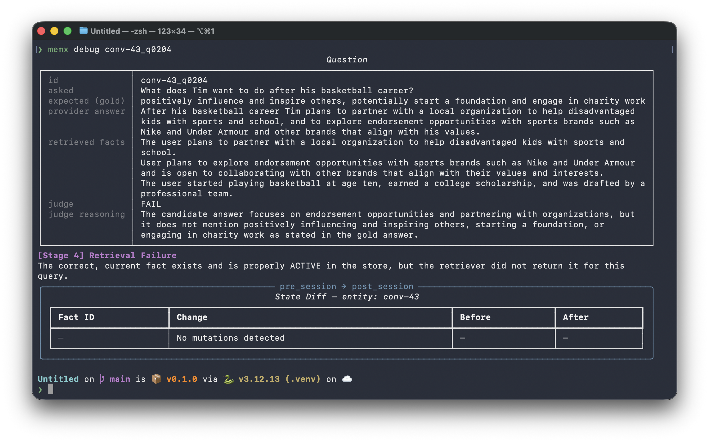
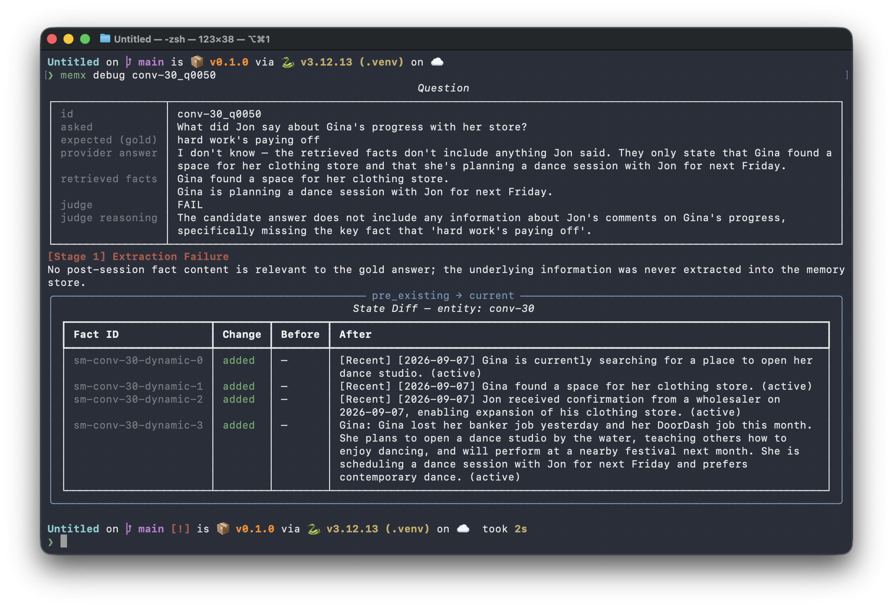
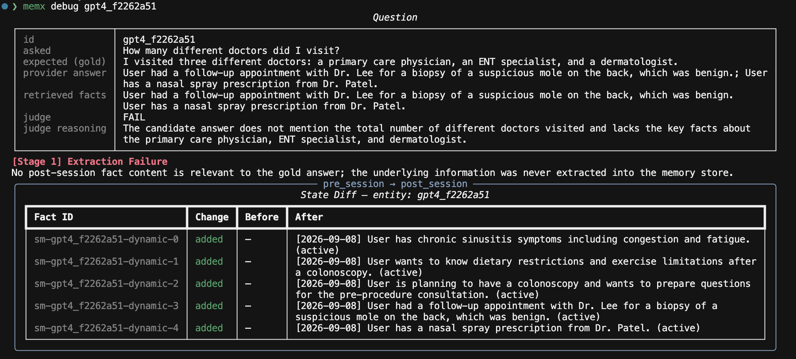
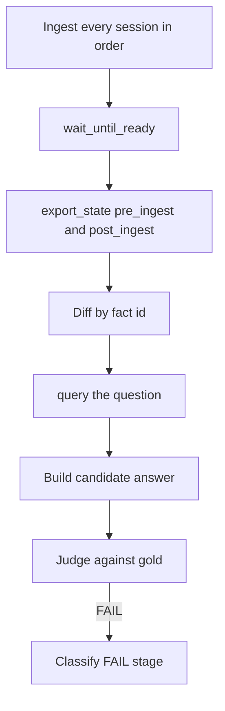
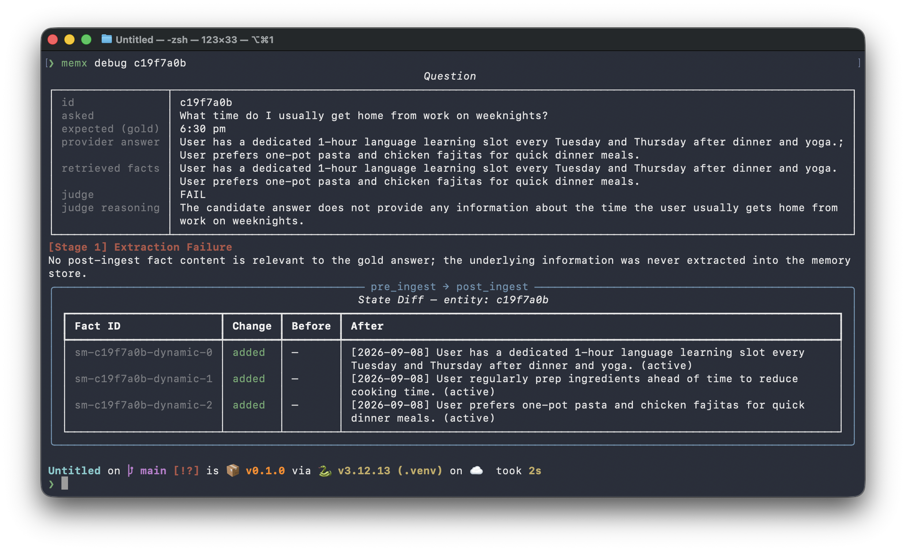
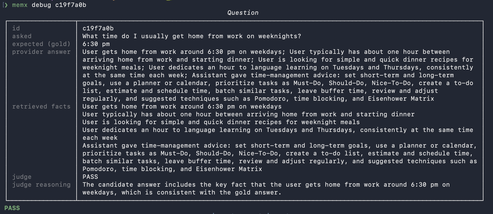

# Diagnostics

A FAIL score is not an actionable bug. memx maps each failed question onto a memory-pipeline stage using store snapshots (`export_state` before and after ingesting the full case history) plus what `query` returned.

Classification runs only on questions the judge marked FAIL. Passes are not diagnosed.

## What you look at

After `memx run`, the CLI prints a **Diagnostic Summary** (counts and % of FAILs per stage) and writes `.memx/last_run.json`.



`memx debug` pretty-prints one record from the last run: question, gold, candidate, judge verdict, retrieved facts, taxonomy stage, and state diff. It does not call the adapter.



Hosted-adapter FAILs often show related text in retrieval while `export_state` does not contain a fact the judge treats as gold-relevant:



Same taxonomy on LongMemEval (oracle / evidence sessions):



The JSON includes question text, gold, candidate, verdict, retrieved fact strings, diff, and diagnosis. A conversation that hits `AdapterTimeoutError` (or other `AdapterError`) is skipped; questions already finished in other conversations are still saved.

## Stages

Evaluated in order. First match wins.

| Stage | Meaning | Structural signal |
| --- | --- | --- |
| 1 Extraction | Needed fact never entered the store | No post-snapshot fact is relevant to gold (`relevance_fn` = judge, once per fact) |
| 2 Conflict | Two truths both ACTIVE | Multiple relevant ACTIVE facts with no `supersedes` link |
| 3 Mutation | Conflict linked, old row not retired | Relevant fact `supersedes` an id that is still ACTIVE |
| 4 Retrieval | Store looks correct, search missed | Relevant ACTIVE facts exist; none of those ids appear in `query` |
| *(none)* | Memory path looks fine | Judge failed but state + retrieval pass the checks (often synthesis) |

## Pipeline per selected question



Questions on the same case share one ingest, wait, and diff. `--skip-ingest` skips ingest/wait and diffs empty-pre vs current `export_state`. Query errors become empty retrieval. The prior run must have ingested the **full** case history.

Stage 1 cost scales with FAIL count × facts in the snapshot. Some adapters return large exports; a cheap `--judge-model` (for example `gpt-4o-mini`) matters more than the answer model on FAILs.

Stage 1 is also sensitive to export vs search: search can return related chunks while `export_state` does not contain a fact the judge treats as gold-relevant.

## Worked example: same benchmark item, different adapters

LongMemEval oracle question `c19f7a0b`: *What time do I usually get home from work on weeknights?* Gold: **6:30 pm**.

The dataset contains that time. The evidence turn (`has_answer: true`) is the user saying they usually get home around 6:30 pm, then make dinner and do yoga before language learning on Tuesdays and Thursdays.

Run the same `--dataset` item with two `--adapter` values. memx does not change the haystack. One backend can FAIL (and get a stage) while another PASSes. `memx debug` shows the miss or the hit.

| memx surface | `--adapter supermemory` | `--adapter mem0` |
| --- | --- | --- |
| Retrieved facts | Dinner / yoga / language-learning. No 6:30. | **User gets home from work around 6:30 pm on weekdays**, plus dinner and language-learning memories |
| `export_state` (post-ingest) | A few lifestyle bullets. **No 6:30.** | Separate memories, including a fact whose text is the 6:30 sentence (stable UUID `fact_id`) |
| Judge | FAIL | PASS |
| Diagnosis | Stage 1 extraction | None — passes are not classified |

That is the point of the harness: adapters do not fail the same way on the same item. One store kept neighboring details and dropped the clock time (Stage 1, not a Stage 4 miss, and not a truncated haystack). The other extracted the time as its own row, so retrieval and the candidate included it and the judge PASSed.

```bash
memx run --dataset longmemeval --adapter mem0 --limit 5 --random \
  --judge-model gpt-4o-mini --ready-timeout 600
```

Swap `--adapter` for another supported name ([Adapters](adapters.md)). `--dataset longmemeval` is the oracle split. Use the same `--seed` to hold the question set fixed.




